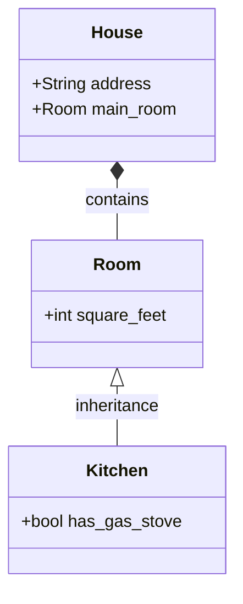

# cw-class-diagrams




```
classDiagram
    class House {
        +String address
        +Room main_room
    }
    class Room {
        +int square_feet
    }
    class Kitchen {
        +bool has_gas_stove
    }

    House *-- Room : contains
    Room <|-- Kitchen : inheritance
```